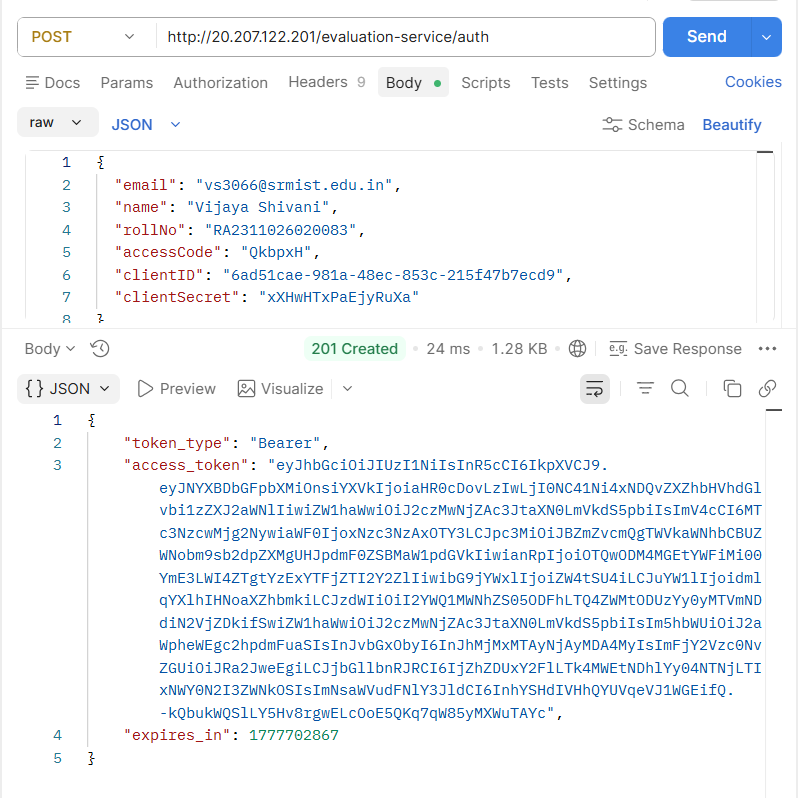
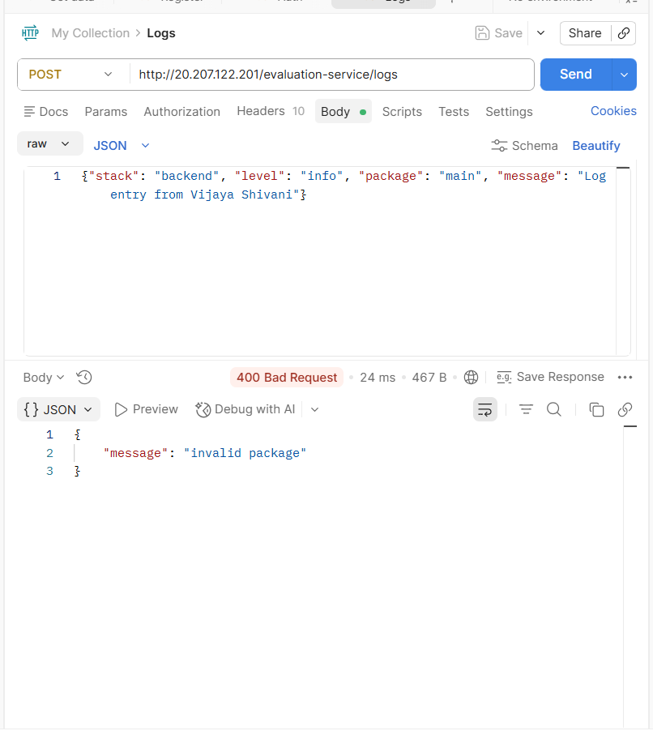

# Logging Middleware

## 📌 Overview

This project implements a reusable logging middleware that sends structured logs to an external test server API.
It includes authentication, token handling, and validation of log inputs.

---

## ⚙️ Tech Stack

* Node.js
* Axios
* dotenv

---

## 🚀 Setup Instructions

```bash
npm install
node src/app.js
```

---

## 🔐 Authentication Flow

1. Register using the Register API to obtain:

   * clientID
   * clientSecret

2. Use Auth API to generate:

   * access_token

3. Use the token in Log API requests.

---

## 📡 Log Function

```js
Log(stack, level, package, message)
```

### Parameters:

* **stack** → backend / frontend
* **level** → debug / info / warn / error / fatal
* **package** → depends on stack
* **message** → log message

---

## 📊 Example Log

```js
Log("backend", "error", "handler", "received string, expected bool")
```

---

## ⚠️ Error Handling

Invalid inputs (e.g., wrong package name) return:

```json
{
  "message": "invalid package"
}
```

---

## 📸 Screenshots

### Registration API



### Auth API


### Log API (Error Case)



---

## 📁 Folder Structure

```
logging_middleware/
├── src/
├── screenshots/
├── README.md
```

---

## ✅ Features

* Reusable logging function
* API integration with authentication
* Structured logging
* Error handling

---

## 👤 Author

